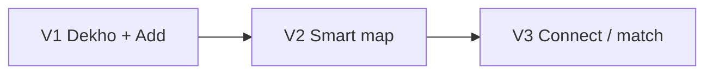
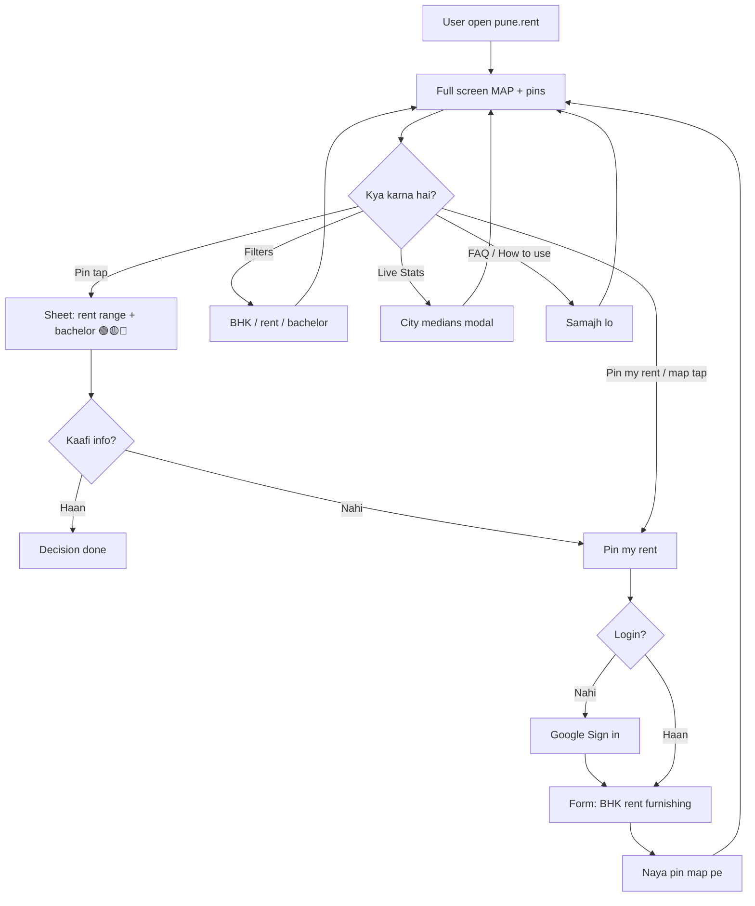
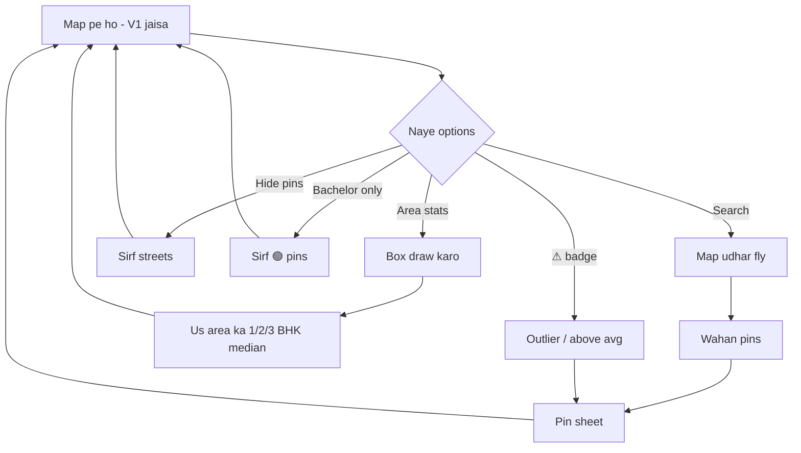
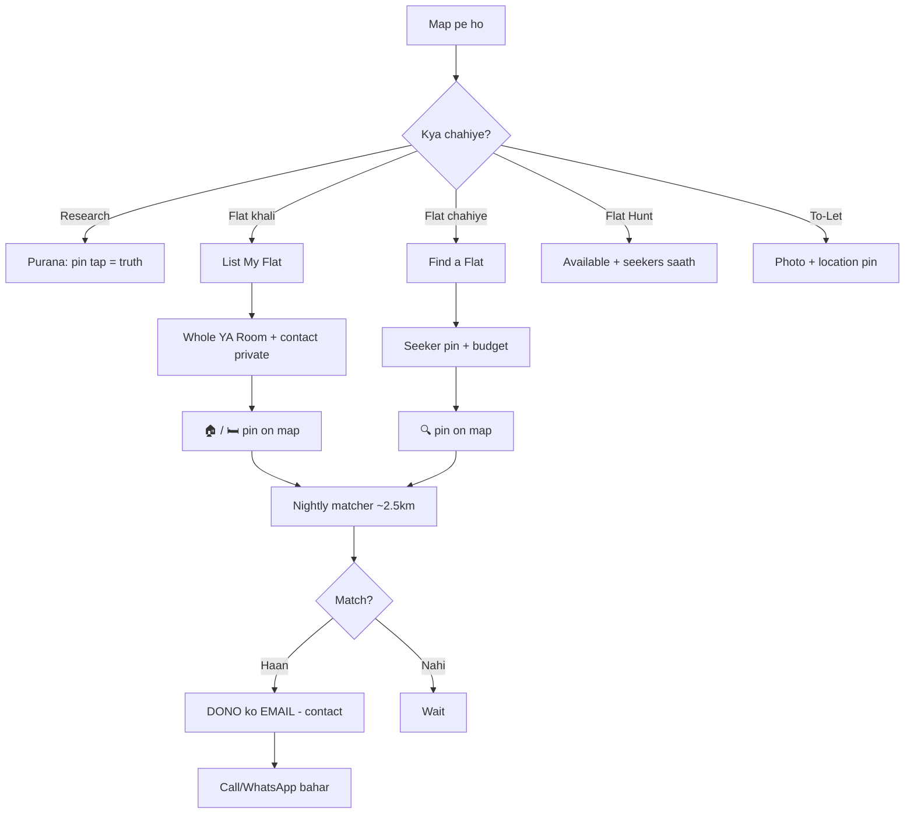

# Pune.rent — System Architecture (One-Page Map)

| Field | Value |
| --- | --- |
| Version | 2.1 |
| Status | Map-first rental intelligence |
| Last updated | 2026-07-17 |
| UX | **ONE PAGE = MAP** · buttons + sheets |
| Companion | [README.md](./README.md), [VERSIONS.md](./VERSIONS.md), [Ideation.md](./Ideation.md), [BengaluruRent-Research.md](./BengaluruRent-Research.md) |
| V1 goal | Intelligence MVP — seed + Bachelor Reality Score + trust (not marketplace) |

---

# 0. Locked product shape

```
┌─────────────────────────────────────────────┐
│  Toolbar                                    │
├─────────────────────────────────────────────┤
│  MAP → tap pin → intelligence sheet         │
│  ranges · deposit · Bachelor Reality Score  │
│  tenant notes · confidence · source         │
└─────────────────────────────────────────────┘

Seed ESTIMATED data (never blank map)
Observations → median / range / n
Matching = V3 email only
```

---

# 0.05 V1 product scope (updated)

Not a marketplace. First useful **rental intelligence layer for Pune**.

| Pillar | Detail |
| --- | --- |
| **Cold start** | Seed Hinjewadi, Wakad, Baner, Kharadi, Viman Nagar, Magarpatta · **Estimated** + low confidence until tenants confirm |
| **Sheet** | Median + min–max + n · deposit · maintenance · Bachelor Reality Score · tenant notes · source/confidence |
| **Bachelor Reality Score** | e.g. *Friendly — 82% confidence based on 43 responses* (not just allowed/not) |
| **Data** | Many observations per society (not one rent field) · source + date + confidence |
| **Trust** | Google auth · outlier flag · report · estimated vs community labels |
| **Success** | Rental decisions helped — not listings created |

**Milestone:** *Where should I live, what should I pay, what problems to expect — before visiting a flat?*

Checklist → [VERSIONS.md](./VERSIONS.md) §3.

---

# 0.1 User flows — simple (Hinglish)

Website pe **pages nahi** — sirf **map + buttons + sheets**.



| Version | User kya kare |
| --- | --- |
| **V1** | Map dekho · pin tap · rent pin karo |
| **V2** | + filters · area box stats · trust badges |
| **V3** | + list/find flat · email match |

---

## V1 flow — rent map



**V1 options:** map dekhna · pin tap · rent pin · filter · stats · FAQ · bachelor vote · report.

---

## V2 flow — smart map + trust



**V2 naya:** search fly · area box stats · hide pins · bachelor filter · outlier badge.

---

## V3 flow — list / find / match



**V3 golden rule:** map pe phone/email **kabhi nahi** — sirf match email mein.

---

## Real life example

1. Rahul Hinjewadi job ke liye aaya → `pune.rent` khola → **map**  
2. Wakad zoom → pin tap → “2BHK ₹22–28k, 🟢 bachelor OK”  
3. Decision clear · baad mein apna rent pin kiya  
4. **V3 baad:** Find a Flat → pin → next day email mein contact  

---

# 1. High-level system

```
┌──────────────┐
│ Browser      │  single Next.js page: /
│ Map + sheets │
└──────┬───────┘
       │ HTTPS
       ▼
┌──────────────┐     ┌─────────────────┐
│ Next.js      │────►│ API /api/v1/*   │
│ (Vercel)     │     │ Node routes or  │
└──────────────┘     │ FastAPI later   │
                     └────────┬────────┘
                              ▼
                     ┌─────────────────┐
                     │ Supabase        │
                     │ Postgres(+GIS)  │
                     │ Google Auth     │
                     └─────────────────┘
                              │
              V2+ ┌───────────┼───────────┐
                  ▼           ▼           ▼
              Redis       Inngest      Resend
              (cache)     (cron)       (V3 email)
                  │
                  ▼
            Google Maps JS API
```

---

# 2. Stack by version

## V1 (intelligence MVP)

| Layer | Choice |
| --- | --- |
| UI | Next.js 15 + TypeScript + Tailwind |
| Map | **Google Maps JS API** (day 1) |
| API | Next.js Route Handlers (or Express/FastAPI) |
| DB | Supabase Postgres + Google Auth |
| Seed | Admin estimated observations for 6 Phase-1 areas |
| Trust | Outlier soft-flag · report · confidence labels |
| Skip | Marketplace, match email, Redis/Inngest optional |

## V2

| Add | Why |
| --- | --- |
| PostGIS | Bbox + area polygon queries |
| Upstash Redis | Pin cache, rate limits |
| Inngest / cron | Outlier + aggregate jobs |

## V3

| Add | Why |
| --- | --- |
| Resend | Match emails |
| Phone OTP | Match trust |
| R2 / Storage | Listing + To-Let photos |

---

# 3. Routes

| Route | Purpose |
| --- | --- |
| `/` | **Entire product** — map + toolbar + all modals |
| `/api/v1/pins` | GET / POST rent pins |
| `/api/v1/pins/[id]` | GET pin detail + aggregate |
| `/api/v1/votes` | Bachelor votes |
| `/api/v1/reviews` | Reviews |
| `/api/v1/reports` | Reports |
| `/api/v1/stats` | Live Stats modal |
| `/api/v1/map/pins` | V2 bbox + filters |
| `/api/v1/map/area-stats` | V2 draw box |
| `/api/v1/listings` | V3 |
| `/api/v1/seekers` | V3 |
| `/api/v1/match/run` | V3 cron |

Optional SEO (later, not primary): `/areas/wakad` → redirect or embed link to `/?area=wakad`.

---

# 4. Database (V1 core)

```sql
-- users via auth.users + public.users profile

CREATE TABLE rent_pins (
  id            UUID PRIMARY KEY DEFAULT gen_random_uuid(),
  user_id       UUID REFERENCES users(id),
  lat           DOUBLE PRECISION NOT NULL,
  lng           DOUBLE PRECISION NOT NULL,
  -- public API returns rounded lat/lng (~100m)
  bhk           SMALLINT NOT NULL,
  rent_inr      INTEGER NOT NULL,
  furnishing    TEXT NOT NULL, -- unfurnished|semi|fully
  society_name  TEXT,
  area_slug     TEXT,          -- wakad, hinjewadi, ...
  is_gated      BOOLEAN,
  deposit_inr   INTEGER,
  deposit_months NUMERIC,
  maintenance_inr INTEGER,
  maintenance_included BOOLEAN DEFAULT false,
  as_of_date    DATE NOT NULL DEFAULT CURRENT_DATE,
  source        TEXT NOT NULL DEFAULT 'community', -- community|admin
  status        TEXT NOT NULL DEFAULT 'active',    -- active|flagged|hidden
  outlier_reason TEXT,
  comment       TEXT,
  ip_hash       TEXT,
  created_at    TIMESTAMPTZ NOT NULL DEFAULT now()
);

CREATE TABLE bachelor_votes (
  id          UUID PRIMARY KEY DEFAULT gen_random_uuid(),
  -- group by society_name+area or pin cluster key
  society_key TEXT NOT NULL,
  user_id     UUID NOT NULL REFERENCES users(id),
  answer      TEXT NOT NULL, -- yes|no|depends
  created_at  TIMESTAMPTZ NOT NULL DEFAULT now(),
  UNIQUE (society_key, user_id)
);

CREATE TABLE reviews (
  id          UUID PRIMARY KEY DEFAULT gen_random_uuid(),
  society_key TEXT NOT NULL,
  user_id     UUID NOT NULL REFERENCES users(id),
  body        TEXT NOT NULL CHECK (char_length(body) <= 500),
  owner_strictness SMALLINT, -- 1-5
  water SMALLINT, power SMALLINT, internet SMALLINT,
  created_at  TIMESTAMPTZ NOT NULL DEFAULT now()
);

CREATE TABLE reports (
  id          UUID PRIMARY KEY DEFAULT gen_random_uuid(),
  pin_id      UUID NOT NULL REFERENCES rent_pins(id),
  user_id     UUID REFERENCES users(id),
  reason      TEXT NOT NULL,
  created_at  TIMESTAMPTZ NOT NULL DEFAULT now()
);
```

## V2 additions

```sql
CREATE EXTENSION IF NOT EXISTS postgis;
ALTER TABLE rent_pins ADD COLUMN location GEOGRAPHY(POINT, 4326);
-- area_stats cache table, society_aliases
```

## V3 additions

```sql
-- listings, seekers, match_events, area_alerts, tolet_boards
-- (see Ideation.md / previous Architecture schema for full columns)
```

---

# 5. Pin Sheet payload (API)

`GET /api/v1/pins/:id` or aggregate by `society_key`:

```json
{
  "pin": { "bhk": 2, "rent_inr": 27000, "furnishing": "semi", "source": "community" },
  "society": { "name": "Blue Ridge", "area": "Hinjewadi", "gated": true },
  "rentIntelligence": {
    "2": {
      "semi": { "p25": 27000, "median": 29000, "p75": 32000, "n": 9 }
    }
  },
  "bachelor": { "score": 82, "yes": 38, "no": 4, "depends": 5, "label": "friendly" },
  "reviews": [],
  "commute": [{ "to": "Hinjewadi Phase 1", "offPeak": 15, "peak": 35 }],
  "confidence": "high"
}
```

---

# 6. Map client architecture

```
RentMap
  ├── GoogleMap
  ├── Markers / MarkerClusterer
  ├── MapControls (locate, hide, area-draw)
  ├── Toolbar (buttons → setModal)
  └── SheetHost
        ├── PinSheet
        ├── PinRentForm
        ├── FiltersPanel
        ├── LiveStatsModal
        └── (V3) ListFlatModal | SeekFlatModal
```

**State (client):**

- `selectedPinId`
- `filters`
- `activeModal`
- `mapBounds`
- `pins[]` (from API)

---

# 7. Seed strategy (cold start)

Empty map = dead product. V1 **must** ship estimated data.

| Area | Target seed (admin) |
| --- | --- |
| Hinjewadi | 50–80 |
| Wakad | 50–80 |
| Baner / Balewadi | 40–60 |
| Kharadi | 40–60 |
| Viman Nagar | 30–40 |
| Magarpatta / Hadapsar | 30–40 |

Every seed row: `source=admin`, `confidence=low`, UI **"Estimated — awaiting tenant confirmation"**.  
Community observations raise confidence and tighten ranges.

**Bachelor Reality Score** on sheet:

```
label + confidence_pct + response_count
e.g. Bachelor Friendly — 82% confidence based on 43 responses
```

Computed from votes; conflicting answers → 🟡 + breakdown.

---

# 8. Security (from Bengaluru lessons)

| Risk | Mitigation |
| --- | --- |
| Fake pin flood | Google auth on write + rate limit |
| Scraping | Rounded coords, rate limit GET |
| RLS mistakes | Service role server-only for privileged ops |
| Contacts leak V3 | Never select email/phone in public pin queries |
| Geo spam | Reject outside Pune bbox |

Pune bbox (approx): lat 18.4–18.7, lng 73.7–74.0 (tune).

---

# 9. Aggregation (sheet ranges)

On read (or sync after write):

```
nearby pins = same society_key OR within ~300m
group by bhk × furnishing
exclude status != active and outliers
median, p25, p75, n
```

Bachelor: % yes/no/depends on `society_key` → 🟢 / 🟡 / 🔴.

---

# 10. V3 matching (summary)

```
Cron daily:
  seekers × listings within 2.5km
  budget + BHK + room prefs
  email both via Resend
  log match_events
  contacts never on map
```

Full rules: [Flow-Architecture.md](./Flow-Architecture.md) §5 · [Ideation.md](./Ideation.md) §9 · [BengaluruRent-Research.md](./BengaluruRent-Research.md)

---

# 11. Repo layout

```
pune-rent/
├── app/page.tsx              # THE map
├── app/api/v1/
├── components/map/
├── components/toolbar/
├── components/sheets/
├── lib/db/ services/ validators/
├── supabase/migrations/
├── supabase/seed/pins.json
└── package.json
```

---

# 12. V1 build (intelligence MVP)

| Day | Ship |
| --- | --- |
| 1 | Next.js + Maps + **seeded estimated** pins |
| 2 | Intelligence sheet (ranges + n + confidence) + Google auth + pin observation |
| 3 | Bachelor Reality Score + outlier flag + report + filters/stats/FAQ + deploy |

Success ≠ feature count. Success = user answers *where / what rent / what problems* from the map.

---

# 13. Backend choice

Next.js `/api`, **Express**, or **FastAPI** — all fine.  
For speed: **Next.js monolith**.  
Split later when match cron / heavy jobs need it.

---

# 14. What changed from older Architecture v1.1

| Old | New (v2.0) |
| --- | --- |
| Society pages first, map later | **Map day 1** |
| Multi-page Home/Area/Society | **One page** |
| No Maps API in MVP | **Maps required** |
| Intelligence = society URL | **Intelligence = Pin Sheet** |

Detail PRD / edge cases still valid in [Ideation.md](./Ideation.md) — apply them on **pins and sheets**, not separate site sections.

---

# 15. Summary

```
Problem: Pune renters lack trustable pre-visit intel
Solve: one map + seeded estimates + observations→ranges
       + Bachelor Reality Score + trust layer
V1 → V2 map tools → V3 match
```

Start: **[README.md](./README.md)** · Build: **[VERSIONS.md](./VERSIONS.md)**.
