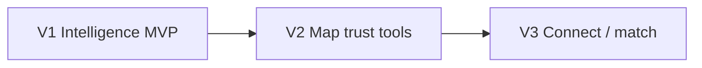

# Pune.rent — Master Versioning & LLM Continuity Doc

> **LLM / next session:** read [README.md](./README.md) then this file.  
> Shape locked: **one-page map**. V1 = rental intelligence MVP (not marketplace).

| Field | Value |
| --- | --- |
| Project | Pune.rent |
| Code path | `pune-rent/` (create on V1 Day 1) |
| UX | ONE PAGE = MAP · buttons + sheets |
| Current target | **V1** |
| Last update | 2026-07-18 |

---

# 0. LLM Quick Start

```
1. README.md           → problem / solution
2. VERSIONS.md (this)  → V1 checklist
3. Architecture.md     → stack, schema, flows
4. Scan pune-rent/
5. Build next unchecked item · update §9 Build Status
```

## DNA (never violate)

```
ONE PAGE MAP
Seed ESTIMATED data (never blank launch)
Observations → median / range / n
Bachelor Reality Score + confidence text
Google auth to write · outlier flag · report
No marketplace / matching in V1
Contacts never on map (V3)
```

---

# 1. Product shape

```
Toolbar → Map → Tap pin → Intelligence sheet
```

---

# 2. Versions



| | V1 | V2 | V3 |
| --- | --- | --- | --- |
| Goal | Decisions on map | Stronger trust + tools | List/seek/match |
| Hero | Bachelor Reality Score | Area stats / layers | Email match |
| Matching | ❌ | ❌ | ✅ |

---

# 3. V1 — Map-First Rental Intelligence MVP

## 3.1 Goal

Not a marketplace. First useful **rental intelligence layer for Pune**.

**Cold start:** seed Hinjewadi, Wakad, Baner, Kharadi, Viman Nagar, Magarpatta with society-level estimates (public sources + research). Always show:

- Source: **Estimated** (until tenants confirm)
- Confidence: **Low / Medium / High**

**North star:** rental decisions helped (sheet views, map interactions, submissions, bachelor votes, return users) — **not** listings.

**Milestone:** user can answer — *Where should I live, what should I pay, what problems to expect — before visiting a flat?*

## 3.2 Intelligence sheet (pin tap)

| Block | Content |
| --- | --- |
| Rent | Median + min–max + **n** (by BHK / furnishing when possible) |
| Deposit / maintenance | Typical expectations |
| **Bachelor Reality Score** | e.g. *Friendly — 82% confidence based on 43 responses* |
| Tenant notes | Short experiences |
| Meta | Estimated vs community · confidence · updated |

No single exact rent as absolute truth — many flats per society.

## 3.3 Bachelor Reality Score

From votes: allowed / visitors / rules / owner signals.  
Output 🟢🟡🔴 + **confidence % + response count**. Show split when opinions conflict.

## 3.4 Observations model

Store many rows per society (e.g. ₹25k semi, ₹35k fully, ₹28k semi) → compute median/range.  
Metadata: `source` (community|admin), date, confidence.

## 3.5 Trust (V1)

Google auth · outlier flag (₹10k vs area ₹25–35k) · report · estimated labels · basic contributor signals.

## 3.6 Routes / toolbar

`/` only as product. APIs: pins, votes, reviews, reports, stats.  
Buttons: How to use · Pin my rent · Filters · Live Stats · FAQ · Locate · Sign in.

## 3.7 Checklist

```
INFRA
[x] Next.js + Supabase + MapLibre
[x] observations/pins + bachelor_votes + reviews + reports
[x] Seed estimated data (6 areas) · source=admin · confidence=low
[x] .env.example

MAP
[x] Full-screen map · seeded pins day 1
[x] Tap → sheet (ranges + Bachelor Reality Score + meta)
[ ] Clusters

WRITE + TRUST
[~] Google auth · pin observation
[~] Bachelor vote → score + confidence copy
[~] Outlier soft-flag · report hide threshold
[x] Estimated vs community labels

POLISH
[~] Filters · Live Stats · FAQ · tour · deploy
```

## 3.8 Success

- [ ] Phase-1 map not empty at launch  
- [ ] Sheet: range + n + confidence (not one fake rent)  
- [ ] Bachelor Reality Score with confidence text  
- [ ] Community can raise confidence over estimates  
- [ ] Outliers don’t silently skew medians  

---

# 4. V2 — Trust + map power

Area draw stats · hide pins · bachelor layer · IT-park focus · outlier cron · search fly-to · rate limits.

```
[ ] PostGIS · bbox API · area stats · outlier cron · Redis rate limit · search
```

---

# 5. V3 — Connect

List My Flat · Find a Flat · Flat Hunt · match email (no contacts on map) · Watch area · To-Let optional.

```
[ ] listings/seekers · OTP · match cron · Resend · no public contacts
```

---

# 6. Feature matrix

| Feature | V1 | V2 | V3 |
| --- | --- | --- | --- |
| Map + seed + sheet | ✅ | ✅ | ✅ |
| Bachelor Reality Score | ✅ | ✅ | ✅ |
| Observations → ranges | ✅ | ✅ | ✅ |
| Trust / outlier / report | ✅ basic | ✅ full | ✅ |
| Area stats / layers | — | ✅ | ✅ |
| List / seek / match | — | — | ✅ |

---

# 7. Codebase layout

```
pune-rent/
  app/page.tsx          # THE map
  app/api/v1/
  components/map|toolbar|sheets/
  supabase/migrations|seed/
```

---

# 8. Detect version

| Signal | Version |
| --- | --- |
| No app | Pre-V1 |
| Map + pins, no listings | V1 |
| Area stats + outlier cron | V2 |
| match_events | V3 |

---

# 9. Build Status

| Version | Status | Notes |
| --- | --- | --- |
| **V1** | `IN PROGRESS` | Core one-page MapLibre MVP wired: seeded/Supabase pins, map tap → intelligence sheet, pin-rent form, basic filters, report action, live stats, FAQ/tour shells. Remaining: real auth, clusters, richer filters, deploy polish. |
| **V2** | `BLOCKED on V1` | |
| **V3** | `BLOCKED on V2` | |

```
Next: scaffold pune-rent/ · seed · map · intelligence sheet
Docs: README + VERSIONS + Architecture (+ Ideation / Bengaluru research)
```

---

# 10. Resume prompt

```
Pune.rent = one-page map intelligence (not marketplace).
Read README.md, VERSIONS.md, Architecture.md.
Build next unchecked V1 item. Update §9 when done.
```
